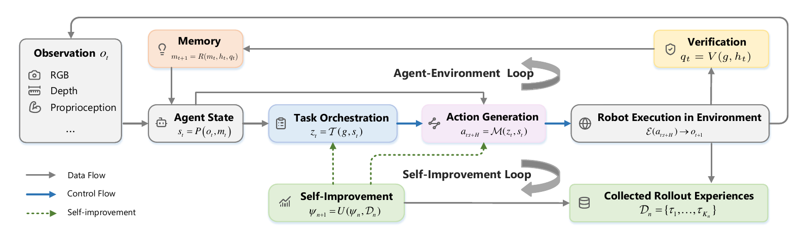
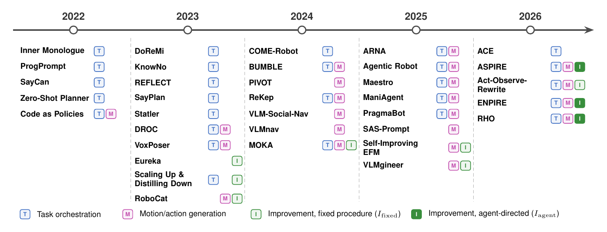
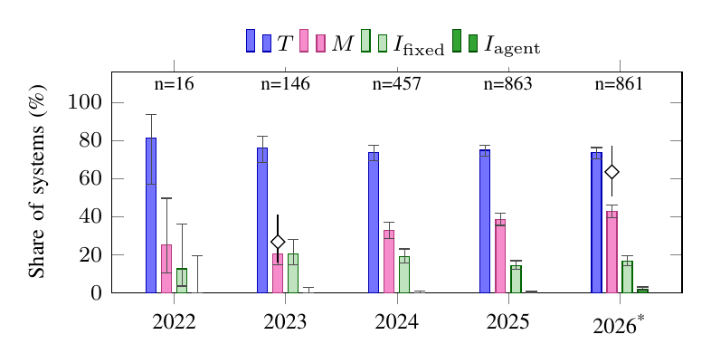

# Awesome Agentic Robotics

This is the companion repository for the survey **A Survey of Agentic Robotics: Toward Continual Self-Improvement**, by Jiaming Wang, Yuhua Jiang, Zhengcheng Shen, and Harold Soh.

**Paper:** [alphaXiv](https://www.alphaxiv.org/abs/2610.rsi-agentic-robotics). **Cite:** see [Citation](#citation).

In classical robotics, engineers decompose tasks, specify objectives, write control code, and repair failures before deployment. In *agentic robotics*, a foundation model (FM), usually a large language model (LLM) or vision-language model (VLM), makes some of these decisions at run time or while the system improves. This repository lists the systems analyzed in the survey and organizes them with the survey's taxonomy: where the FM takes part in generating behavior, which improvement decisions it makes, and how feedback is retained.



*The architecture of agentic robotics used in the survey. In the agent–environment loop, task orchestration decides **what** to do and action generation decides **how** to do it; verification and memory close the loop. A slower self-improvement loop uses accumulated experience to change persistent components, which changes future behavior. Individual systems implement only some of these modules.*

## Contents

- [Taxonomy](#taxonomy)
- [Key findings](#key-findings)
- [Paper list](#paper-list)
  - [Task orchestration (T)](#task-orchestration-t)
  - [Motion/action generation (M)](#motionaction-generation-m)
  - [Task and motion (T + M)](#task-and-motion-t--m)
  - [Fixed-procedure improvement (I_fixed)](#fixed-procedure-improvement-i_fixed)
  - [Agent-directed improvement (I_agent)](#agent-directed-improvement-i_agent)
- [Benchmarks](#benchmarks)
- [Open challenges](#open-challenges)
- [Related surveys](#related-surveys)
- [Survey data](#survey-data)
- [Citation](#citation)
- [Contributing](#contributing)

## Taxonomy

### Three loci of FM participation

The survey codes each system by what the FM actually outputs or decides in the system as evaluated, not by how the system is described. One FM may act at several loci, and a system need not use all of them.

| Locus | The FM decides... | Coded when the FM output contains... | Representative systems |
|---|---|---|---|
| **T**: task orchestration | *what* behavior to pursue next | a subgoal, plan, skill/tool/API call, or semantic target (an object or place) that other modules turn into geometry | SayCan, ProgPrompt, SayPlan, KnowNo, COME-Robot |
| **M**: motion/action generation | *how* the behavior is physically realized | actions or a chosen action candidate, poses, waypoints, keypoints, constraints, cost maps, rewards optimized at execution time, metric skill parameters, or code that computes them; or the actions of an FM policy | PIVOT, VoxPoser, ReKep, Code as Policies, RoboCat |
| **I<sub>fixed</sub>**: fixed-procedure improvement | the *content* of a candidate inside a prescribed update | a new policy, reward, program, or skill (or the data for it), while the designer fixes which artifact changes, what evidence the FM sees, how candidates are tested, and the update procedure | Scaling Up & Distilling Down, RoboCat, Eureka, CaP-X, Act-Observe-Rewrite |
| **I<sub>agent</sub>**: agent-directed improvement | also *how* the improvement proceeds | a candidate plus at least one of the process decisions D1–D4 below | RHO, ASPIRE, ENPIRE |

### Who makes the improvement decisions?

Both kinds of improvement may use an FM to write the new policy, program, reward, or skill. They differ in five observable decisions:

- **D1** which kind of artifact to change (policy, reward, training procedure, or data);
- **D2** what evidence to collect;
- **D3** which tests or experiments to run;
- **D4** how the update procedure works;
- **D5** whether a candidate is kept.

A system is I<sub>agent</sub> if the FM makes at least one of D1–D4. D5 does not enter the label, because a fixed acceptance rule is often a deliberate safety choice.

### Feedback-closure regimes

How verified feedback influences later behavior:

| Regime | What is kept |
|---|---|
| Open loop | No execution feedback is used. |
| Step-level | Feedback shapes only the next decision. |
| Within-rollout memory | State, execution traces, or diagnoses are kept for the rest of the current task instance. |
| Cross-rollout memory | Records (lessons, corrections, trajectories) are retrieved or replayed in later task instances. |
| Persistent modification | An executable or learned artifact (weights, reward, program, skill, planning model) is changed and used in place of the old one. |

The regime describes how feedback is retained. It does not rank systems: a step-level controller can be more reliable than a system that learns across rollouts.

### Evolution of FM participation



*Representative systems by year of first public version, marked by the loci at which FMs influence robot behavior (coded from full text). Outlined I: fixed-procedure improvement; filled I: agent-directed improvement. The figure shows a trend, not a ranking.*

## Key findings

The survey ran a systematic search of arXiv and OpenAlex (January 2022 to September 2026), screened the results, and coded all 2,343 systems within its scope. It then read the full texts of 78 of them in depth.

- **FM decisions are moving from tasks to motion.** In 2022–2023, FMs mostly planned or selected skills above a fixed execution stack. Later systems also generate programs, geometric objectives, keypoints, constraints, and actions. From full-text coding, the share of systems in which the FM produces motion-level outputs rose from 27% in 2023 to 63% in 2026. Task-level participation stayed near three quarters.
- **Persistent improvement is not new, but agent-directed improvement is.** In every year, about one system in five improves persistently, mostly through fixed data-collection, distillation, reward-search, or learning pipelines. Only 17 of the 2,343 systems let the FM direct the improvement, and 16 of them appeared in 2026.
- **The delegated decisions come separately.** Among the 17 agent-directed systems, the FM chooses its evidence in 15, its tests in 10, the update procedure in 7, and the kind of artifact in 7.
- **Persistent modification is not yet continual improvement.** Representative self-improving systems run a single improvement iteration (RoboCat) or produce one artifact per task (Eureka, CaP-X, Act-Observe-Rewrite, ASPIRE). Among the 17 agent-directed systems, only one re-runs earlier regression tests before it promotes a change, 7 test on held-out tasks, and 8 report real-robot results.
- **There is no evidence yet that more FM authority pays off.** The only equal-budget comparison with fixed-procedure loops (HARBOR against Eureka and REvolve) ran in simulation and gave the agent human heuristics that the baselines lacked.
- **One role label hides different systems.** Maestro, CaP-X, Act-Observe-Rewrite, and RHO are all "coding agents". However, they differ in whether the FM is called on every trial, whether the agent tests its own edits, and who decides that a change is kept.



*Share of the 2,343-system corpus at each locus by year, coded from abstracts. Abstracts understate motion-level outputs. Diamonds show the motion-level share corrected with full-text coding of a random sample. 2026 covers January to September.*

## Paper list

Each table is sorted newest first. **Year** is the year of the first public version (usually arXiv v1). **Evidence** says whether the paper reports simulated experiments, physical-robot experiments, or both.

- **Analyzed in the survey:** the 78 systems whose full texts were coded for the survey (the per-system table in the paper's appendix). For each one, the table gives its feedback-closure regime and its main feedback-closure mechanism. Systems that also improve persistently are listed under the two improvement sections.
- **More systems:** other papers within the survey's scope, placed by the abstract-level coding of the survey corpus.

### Task orchestration (T)

The FM decides *what* to do next: subgoals, plans, skill or API calls, or semantic targets. Other modules turn these decisions into motion. Systems make task-level decisions executable in four ways: they restrict the FM to exposed skills, ground its choices in the current state, rely on a downstream solver, or recover from execution feedback.

**Analyzed in the survey (27)**

| Year | System and paper | Venue | Evidence | Feedback regime | Feedback closure |
|---|---|---|---|---|---|
| 2026 | **ACE** — [Agentic Control for Embodied Manipulation via Zero-Shot Workflow Reasoning](https://arxiv.org/abs/2607.04162) | arXiv | Physical | Within-rollout memory | Verification, repair, and replanning of sub-goals. |
| 2026 | **HoloMind / LongAct** — [When Robots Do the Chores: A Benchmark and Agent for Long-Horizon Household Task Execution](https://arxiv.org/abs/2605.14504) | arXiv | Simulation | Cross-rollout memory | Episodic experience memory. |
| 2024 | **COME-Robot** — [Closed-Loop Open-Vocabulary Mobile Manipulation with GPT-4V](https://arxiv.org/abs/2404.10220) | ICRA 2025 | Physical | Within-rollout memory | Verification and hierarchical recovery. |
| 2024 | **ORGANA** — [A Robotic Assistant for Automated Chemistry Experimentation and Characterization](https://arxiv.org/abs/2401.06949) | Matter 2025 | Physical | Within-rollout memory | LLM plans; records summarized within one campaign. |
| 2024 | **ChemAgents** — [A Multiagent-Driven Robotic AI Chemist Enabling Autonomous Chemical Research on Demand](https://doi.org/10.1021/jacs.4c17738) | JACS 2025 | Physical | Within-rollout memory | Multi-agent LLM compiles lab-robot workflows. |
| 2023 | **CLAIRify** — [Large Language Models for Chemistry Robotics](https://doi.org/10.1007/s10514-023-10136-2) | Autonomous Robots 2023 | Physical | Step-level | Verified LLM task plans for a chemistry lab robot. |
| 2023 | **SMART-LLM** — [Smart Multi-Agent Robot Task Planning Using Large Language Models](https://arxiv.org/abs/2309.10062) | IROS 2024 | Sim + physical | Open loop | LLM multi-robot decomposition and allocation. |
| 2023 | **PG-VLM** — [Physically Grounded Vision-Language Models for Robotic Manipulation](https://arxiv.org/abs/2309.02561) | ICRA 2024 | Physical | Open loop | Physically grounded VLM answers planner queries. |
| 2023 | **ConceptGraphs** — [Open-Vocabulary 3D Scene Graphs for Perception and Planning](https://arxiv.org/abs/2309.16650) | ICRA 2024 | Sim + physical | Step-level | LLM selects objects from 3D scene-graph captions. |
| 2023 | **SayPlan** — [Grounding Large Language Models Using 3D Scene Graphs for Scalable Robot Task Planning](https://arxiv.org/abs/2307.06135) | CoRL 2023 | Simulation | Within-rollout memory | Scene-graph simulator feedback and iterative replanning. |
| 2023 | **KnowNo** — [Robots That Ask For Help: Uncertainty Alignment for Large Language Model Planners](https://arxiv.org/abs/2307.01928) | CoRL 2023 | Sim + physical | Step-level | Uncertainty-triggered help seeking. |
| 2023 | **DoReMi** — [Grounding Language Model by Detecting and Recovering from Plan-Execution Misalignment](https://arxiv.org/abs/2307.00329) | IROS 2024 | Sim + physical | Within-rollout memory | Constraint-violation detection and recovery. |
| 2023 | **Statler** — [State-Maintaining Language Models for Embodied Reasoning](https://arxiv.org/abs/2306.17840) | ICRA 2024 | Sim + physical | Within-rollout memory | Maintained world-state memory. |
| 2023 | **REFLECT** — [Summarizing Robot Experiences for Failure Explanation and Correction](https://arxiv.org/abs/2306.15724) | CoRL 2023 | Sim + physical | Within-rollout memory | Failure diagnosis and correction planning. |
| 2023 | **AutoTAMP** — [Autoregressive Task and Motion Planning with LLMs as Translators and Checkers](https://arxiv.org/abs/2306.06531) | ICRA 2024 | Sim + physical | Open loop | LLM translates language into STL for TAMP. |
| 2023 | **TidyBot** — [Personalized Robot Assistance with Large Language Models](https://arxiv.org/abs/2305.05658) | Autonomous Robots 2023 | Physical | Step-level | LLM-summarized user preferences for object placement. |
| 2023 | **L3MVN** — [Leveraging Large Language Models for Visual Target Navigation](https://arxiv.org/abs/2304.05501) | IROS 2023 | Sim + physical | Step-level | LM scores each frontier; argmax picks the subgoal. |
| 2023 | **Text2Motion** — [From Natural Language Instructions to Feasible Plans](https://arxiv.org/abs/2303.12153) | Autonomous Robots 2023 | Simulation | Step-level | LLM skill plans; learned feasibility and STAP compute geometry. |
| 2023 | **PaLM-E** — [An Embodied Multimodal Language Model](https://arxiv.org/abs/2303.03378) | ICML 2023 | Sim + physical | Step-level | Re-prompted each step with image and past steps. |
| 2022 | **LLM-Planner** — [Few-Shot Grounded Planning for Embodied Agents with Large Language Models](https://arxiv.org/abs/2212.04088) | ICCV 2023 | Simulation | Within-rollout memory | Few-shot LLM subgoal plans, re-planned with observed objects. |
| 2022 | **HULC++** — [Grounding Language with Visual Affordances over Unstructured Data](https://arxiv.org/abs/2210.01911) | ICRA 2023 | Physical | Open loop | GPT-3 subgoal sequences for a learned policy. |
| 2022 | **ProgPrompt** — [Generating Situated Robot Task Plans Using Large Language Models](https://arxiv.org/abs/2209.11302) | ICRA 2023 | Sim + physical | Step-level | Assertion checks with scripted recovery branches. |
| 2022 | **NLMap** — [Open-vocabulary Queryable Scene Representations for Real World Planning](https://arxiv.org/abs/2209.09874) | ICRA 2023 | Physical | Step-level | LLM queries an open-vocabulary scene representation. |
| 2022 | **LM-Nav** — [Robotic Navigation with Large Pre-Trained Models of Language, Vision, and Action](https://arxiv.org/abs/2207.04429) | CoRL 2022 | Physical | Open loop | LLM landmark extraction grounded by CLIP. |
| 2022 | **Inner Monologue** — [Embodied Reasoning through Planning with Language Models](https://arxiv.org/abs/2207.05608) | CoRL 2022 | Sim + physical | Within-rollout memory | Success, scene, and human feedback in the planning prompt. |
| 2022 | **SayCan** — [Do As I Can, Not As I Say: Grounding Language in Robotic Affordances](https://arxiv.org/abs/2204.01691) | CoRL 2022 | Physical | Step-level | Affordance-weighted skill selection from the current state. |
| 2022 | **Zero-Shot Planner** — [Language Models as Zero-Shot Planners: Extracting Actionable Knowledge for Embodied Agents](https://arxiv.org/abs/2201.07207) | ICML 2022 | Simulation | Open loop | Plan generation mapped to admissible actions. |

**More systems**

| Year | System and paper | Venue | Evidence | Summary |
|---|---|---|---|---|
| 2026 | **Closed-Loop Multi-Agent Manipulation** — [A Closed-Loop Multi-Agent Framework for Robust Multi-Robot Manipulation](https://arxiv.org/abs/2607.06990) | RSS 2026 | Physical | A planning agent, per-robot manipulation agents, and a verification agent coordinate tool use and feed semantic corrections back after physical execution. |
| 2026 | **Language-to-Action Evaluation** — [From Language to Action: Can LLM-Based Agents Be Used for Embodied Robot Cognition?](https://arxiv.org/abs/2603.03148) | arXiv | Simulation | The study evaluates an LLM cognitive core with working and episodic memory and exposes persistent grounding and reliability limitations. |
| 2026 | **Agentic AI for Robot Control** — [Flexible but still Fragile](https://arxiv.org/abs/2602.13081) | arXiv | Physical | A physical-robot study stress-tests iterative tool-based planners and documents how operator intervention, timing, and execution events still cause failures. |
| 2025 | **ASP** — [Agentic Scene Policies: Unifying Space, Semantics, and Affordances for Robot Action](https://arxiv.org/abs/2509.19571) | arXiv | Physical | ASP lets an LLM agent query an object-centric scene representation for semantic, spatial, and affordance facts that guide downstream motion planning. |
| 2025 | **L3M+P** — [Lifelong Planning with Large Language Models](https://arxiv.org/abs/2508.01917) | arXiv | Sim + physical | L3M+P maintains a verified knowledge graph from sensor and language updates and retrieves it to construct classical planning problems. |
| 2025 | **Memory-Augmented Household Agent** — [LLM-Empowered Embodied Agent for Memory-Augmented Task Planning in Household Robotics](https://arxiv.org/abs/2504.21716) | Austrian Robotics Workshop 2025 | Physical | Routing, planning, and knowledge agents use retrieval-augmented long-term object memory to plan household service-robot tasks. |
| 2025 | **Reflective Planning** — [Vision-Language Models for Multi-Stage Long-Horizon Robotic Manipulation](https://arxiv.org/abs/2502.16707) | CoRL 2025 | Simulation | A VLM uses a learned dynamics model to imagine future states and reflect on suboptimal actions before executing multi-stage manipulation plans. |
| 2024 | **ROSA** — [Robot Operating System Agent](https://arxiv.org/abs/2410.06472) | IEEE Aerospace 2025 | Sim + physical | ROSA exposes validated ROS 1 and ROS 2 operations as agent tools and adds constraint checks for natural-language robot inspection and control. |
| 2024 | **SELP** — [Generating Safe and Efficient Task Plans for Robot Agents with Large Language Models](https://arxiv.org/abs/2409.19471) | arXiv | Simulation | SELP maps language to temporal logic using equivalence voting and constrains decoding so generated drone and manipulation plans satisfy user rules. |
| 2024 | **MHRC** — [Closed-loop Decentralized Multi-Heterogeneous Robot Collaboration with Large Language Models](https://arxiv.org/abs/2409.16030) | arXiv | Simulation | MHRC lets heterogeneous mobile and manipulation agents exchange textual feedback, request help, and revise decentralized collaborative plans. |
| 2024 | **AutoRT** — [Embodied Foundation Models for Large Scale Orchestration of Robotic Agents](https://arxiv.org/abs/2401.12963) | arXiv | Physical | AutoRT combines VLM scene understanding, LLM task proposals, and safety filters to orchestrate a robot fleet that collected 77,000 real episodes. |
| 2023 | **Instruct2Act** — [Mapping Multi-modality Instructions to Robotic Actions with Large Language Model](https://arxiv.org/abs/2305.11176) | arXiv | Physical | Instruct2Act generates Python programs that call foundation-model perception APIs and robot primitives directly from multimodal instructions. |
| 2023 | **Demo2Code** — [From Summarizing Demonstrations to Synthesizing Code via Extended Chain-of-Thought](https://arxiv.org/abs/2305.16744) | NeurIPS 2023 | Simulation | Demo2Code recursively summarizes demonstrations into reusable behavior specifications and expands them into executable robot programs. |
| 2023 | **Grounded Decoding** — [Guiding Text Generation with Grounded Models for Robot Control](https://arxiv.org/abs/2303.00855) | NeurIPS 2023 | Sim + physical | Grounded Decoding combines token probabilities with affordance, safety, and preference model scores while an LLM generates a robot plan. |

### Motion/action generation (M)

The FM outputs information that directly governs physical realization. For example, it may select an action candidate, specify a cost or reward for a solver, or choose the next viewpoint.

**Analyzed in the survey (6)**

| Year | System and paper | Venue | Evidence | Feedback regime | Feedback closure |
|---|---|---|---|---|---|
| 2025 | **SAS-Prompt** — [Large Language Models as Numerical Optimizers for Robot Self-Improvement](https://arxiv.org/abs/2504.20459) | ICRA 2025 | Sim + physical | Cross-rollout memory | In-context controller-parameter search from rollout traces. |
| 2024 | **VLMnav** — [End-to-End Navigation with Vision-Language Models: Transforming Spatial Reasoning into Question-Answering](https://arxiv.org/abs/2411.05755) | NeSy 2025 | Simulation | Step-level | Step-wise visual navigation decisions. |
| 2024 | **VLM-Social-Nav** — [Socially Aware Robot Navigation Through Scoring Using Vision-Language Models](https://arxiv.org/abs/2404.00210) | IEEE RA-L 2025 | Physical | Step-level | VLM-derived social cost in per-step replanning. |
| 2024 | **PIVOT** — [Iterative Visual Prompting Elicits Actionable Knowledge for VLMs](https://arxiv.org/abs/2402.07872) | ICML 2024 | Sim + physical | Step-level | Iterative visual action-candidate selection. |
| 2023 | **Language to Rewards** — [Language to Rewards for Robotic Skill Synthesis](https://arxiv.org/abs/2306.08647) | CoRL 2023 | Sim + physical | Step-level | Reward-mediated skill realization via MPC. |
| 2023 | **NavGPT** — [Explicit Reasoning in Vision-and-Language Navigation with Large Language Models](https://arxiv.org/abs/2305.16986) | AAAI 2024 | Simulation | Within-rollout memory | LLM picks the next viewpoint from described views and history. |

### Task and motion (T + M)

The FM chooses the behavior and also specifies how it is realized. It does this through executable programs, geometric constraints, value maps, or parameterized skill calls.

**Analyzed in the survey (21)**

| Year | System and paper | Venue | Evidence | Feedback regime | Feedback closure |
|---|---|---|---|---|---|
| 2026 | **Uni-Skill** — [Building Self-Evolving Skill Repository for Generalizable Robotic Manipulation](https://arxiv.org/abs/2603.02623) | ICRA 2026 | Sim + physical | Open loop | On-demand skill retrieval from an offline skill repository. |
| 2026 | **ALRM** — [Agentic LLM for Robotic Manipulation](https://arxiv.org/abs/2601.19510) | arXiv | Simulation | Within-rollout memory | ReAct-style tool feedback. |
| 2025 | **Maestro** — [Orchestrating Robotics Modules with Vision-Language Models for Zero-Shot Generalist Robots](https://maestro-robot.github.io/static/Maestro.pdf) | NeurIPS SpaVLE Workshop 2025 | Physical | Cross-rollout memory | Cross-trial in-context reflection. |
| 2025 | **Reliable Code-as-Policies** — [Towards Reliable Code-as-Policies: A Neuro-Symbolic Framework for Embodied Task Planning](https://arxiv.org/abs/2510.21302) | NeurIPS 2025 | Sim + physical | Within-rollout memory | Interactive validation during code generation. |
| 2025 | **ManiAgent** — [An Agentic Framework for General Robotic Manipulation](https://arxiv.org/abs/2510.11660) | arXiv | Sim + physical | Within-rollout memory | Cross-task action-sequence cache (retrieval memory). |
| 2025 | **PragmaBot** — [A Pragmatist Robot: Learning to Plan Tasks by Experiencing the Real World](https://arxiv.org/abs/2507.16713) | IEEE RA-L 2026 | Physical | Cross-rollout memory | Experiential memory summarized from trial and error. |
| 2025 | **ARNA** — [General-Purpose Robotic Navigation via LVLM-Orchestrated Perception, Reasoning, and Acting](https://arxiv.org/abs/2506.17462) | arXiv | Simulation | Within-rollout memory | Iterative tool-use feedback. |
| 2025 | **RAI** — [Flexible Agent Framework for Embodied AI](https://arxiv.org/abs/2505.07532) | PAAMS 2025 | Sim + physical | Within-rollout memory | Robot-tool feedback, including point targets. |
| 2025 | **Agentic Robot** — [A Brain-Inspired Framework for Vision-Language-Action Models in Embodied Agents](https://arxiv.org/abs/2505.23450) | arXiv | Simulation | Within-rollout memory | Verifier triggers a fixed recovery routine and retry. |
| 2025 | **ELLMER** — [Embodied Large Language Models Enable Robots to Complete Complex Tasks in Unpredictable Environments](https://doi.org/10.1038/s42256-025-01005-x) | Nature Machine Intelligence 2025 | Physical | Step-level | GPT-4 writes retrieved code with force/vision feedback. |
| 2024 | **BUMBLE** — [Unifying Reasoning and Acting with Vision-Language Models for Building-Wide Mobile Manipulation](https://arxiv.org/abs/2410.06237) | ICRA 2025 | Physical | Cross-rollout memory | Short- and long-term episodic memory. |
| 2024 | **ReKep** — [Spatio-Temporal Reasoning of Relational Keypoint Constraints for Robotic Manipulation](https://arxiv.org/abs/2409.01652) | CoRL 2024 | Sim + physical | Step-level | Re-optimization of relational keypoint constraints. |
| 2023 | **DROC** — [Distilling and Retrieving Generalizable Knowledge for Robot Manipulation via Language Corrections](https://arxiv.org/abs/2311.10678) | ICRA 2024 | Physical | Cross-rollout memory | Retrieval of knowledge distilled from language corrections. |
| 2023 | **ChatGPT Research Group** — [ChatGPT Research Group for Optimizing the Crystallinity of MOFs and COFs](https://doi.org/10.1021/acscentsci.3c01087) | ACS Central Science 2023 | Physical | Cross-rollout memory | GPT-4 writes a liquid-handling script; BO picks conditions. |
| 2023 | **Incremental humanoid learning** — [Incremental Learning of Humanoid Robot Behavior from Natural Interaction and Large Language Models](https://arxiv.org/abs/2309.04316) | Frontiers in Robotics and AI 2024 | Sim + physical | Cross-rollout memory | Corrected interactions stored and retrieved. |
| 2023 | **VoxPoser** — [Composable 3D Value Maps for Robotic Manipulation with Language Models](https://arxiv.org/abs/2307.05973) | CoRL 2023 | Sim + physical | Step-level | Geometric replanning over composed value maps. |
| 2023 | **RoCo** — [Dialectic Multi-Robot Collaboration with Large Language Models](https://arxiv.org/abs/2307.04738) | ICRA 2024 | Sim + physical | Within-rollout memory | Dialog-based coordination and collision-aware replanning. |
| 2023 | **RoboGPT (construction)** — [Robot-Enabled Construction Assembly with Automated Sequence Planning Based on ChatGPT: RoboGPT](https://arxiv.org/abs/2304.11018) | Buildings 2023 | Sim + physical | Open loop | ChatGPT assembly sequences with pipe coordinates. |
| 2023 | **LLM-GROP** — [Task and Motion Planning with Large Language Models for Object Rearrangement](https://arxiv.org/abs/2303.06247) | IROS 2023 | Sim + physical | Open loop | LLM arrangement offsets instantiated by TAMP. |
| 2022 | **VLMaps** — [Visual Language Maps for Robot Navigation](https://arxiv.org/abs/2210.05714) | ICRA 2023 | Sim + physical | Open loop | LLM writes navigation code with landmark goals and metric moves. |
| 2022 | **Code as Policies** — [Language Model Programs for Embodied Control](https://arxiv.org/abs/2209.07753) | ICRA 2023 | Sim + physical | Step-level | Reactive perception–action loops in generated code. |

**More systems**

| Year | System and paper | Venue | Evidence | Summary |
|---|---|---|---|---|
| 2026 | **ARCHITECT** — [A Few Words Go a Long Way: Language Guided Robot Policy Synthesis](https://arxiv.org/abs/2607.23784) | arXiv | Physical | ARCHITECT treats policy acquisition as interactive program synthesis and distills trace-grounded language corrections into a persistent skill library. |
| 2025 | **ModuLoop** — [Low-Level Code Generation using Modular Synthesizer and Closed-Loop Debugger for Robotic Control](https://doi.org/10.1109/LRA.2025.3623437) | IEEE RA-L 2025 | Physical | ModuLoop generates low-level control code module by module, inserts diagnostic probes, and iteratively debugs executions for calibration and manipulation. |
| 2024 | **MALMM** — [Multi-Agent Large Language Models for Zero-Shot Robotic Manipulation](https://arxiv.org/abs/2411.17636) | IROS 2025 | Sim + physical | MALMM separates high-level planning, low-level code generation, and supervision among specialist LLM agents that replan from each observation. |
| 2024 | **IFVF Code Generation** — [Enabling Robots to Follow Abstract Instructions and Complete Complex Dynamic Tasks](https://arxiv.org/abs/2406.11231) | arXiv | Physical | GPT-4 retrieves domain knowledge and writes robot code whose execution is adapted through integrated force and visual feedback. |
| 2024 | **LABOR** — [Large Language Models for Orchestrating Bimanual Robots](https://arxiv.org/abs/2404.02018) | arXiv | Simulation | LABOR uses an LLM to analyze task dependencies and synthesize coordination policies for two robot arms without bimanual demonstrations. |
| 2024 | **RobotScript** — [An LLM and Simulator-Assisted Robot Programming System for Human-Robot Interaction](https://arxiv.org/abs/2402.14623) | arXiv | Sim + physical | RobotScript maps free-form instructions to a deployable robot API, validates generated programs in simulation, and transfers them to physical arms. |
| 2023 | **ChatGPT for Robotics** — [Design Principles and Model Abilities](https://arxiv.org/abs/2306.17582) | IEEE Access 2024 | Sim + physical | The framework exposes a high-level robot function library and uses dialogue, code generation, and closed-loop feedback to refine behavior across embodiments. |

### Fixed-procedure improvement (I_fixed)

The system changes a persistent artifact, such as policy weights, a reward program, a skill library, or a planning model. The FM supplies candidates inside an update procedure that the designer fixes.

**Analyzed in the survey (21)**

| Year | System and paper | Venue | Evidence | Loci | Feedback closure |
|---|---|---|---|---|---|
| 2026 | **CaP-X / CaP-Agent0** — [A Framework for Benchmarking and Improving Coding Agents for Robot Manipulation](https://arxiv.org/abs/2603.22435) | ICML 2026 | Sim + physical | T, M, I<sub>fixed</sub> | One-pass skill-library synthesis from successful rollouts. |
| 2026 | **Act-Observe-Rewrite** — [Multimodal Coding Agents as In-Context Policy Learners for Robot Manipulation](https://arxiv.org/abs/2603.04466) | arXiv | Simulation | T, M, I<sub>fixed</sub> | Policy-code rewriting from a fixed outcome package. |
| 2025 | **Self-Improving EFM** — [Self-Improving Embodied Foundation Models](https://arxiv.org/abs/2509.15155) | NeurIPS 2025 | Sim + physical | M, I<sub>fixed</sub> | Online policy update from self-predicted rewards. |
| 2025 | **VLMgineer** — [Vision-Language Models as Robotic Toolsmiths](https://arxiv.org/abs/2507.12644) | ICLR 2026 | Sim + physical | M, I<sub>fixed</sub> | Evolutionary tool/action co-design. |
| 2025 | **LAMARL** — [LLM-Aided Multi-Agent Reinforcement Learning for Cooperative Policy Generation](https://arxiv.org/abs/2506.01538) | IEEE RA-L 2025 | Sim + physical | M, I<sub>fixed</sub> | LLM prior policy and reward code for MARL. |
| 2024 | **LLM locomotion design** — [Leveraging Large Language Models for Comprehensive Locomotion Control in Humanoid Robots Design](https://doi.org/10.1016/j.birob.2024.100187) | Biomimetic Intelligence and Robotics 2024 | Simulation | M, I<sub>fixed</sub> | LLM designs trajectories, IK, and reward code. |
| 2024 | **LASP** — [Language-Augmented Symbolic Planner for Open-World Task Planning](https://arxiv.org/abs/2407.09792) | RSS 2024 | Simulation | T, I<sub>fixed</sub> | LLM diagnoses errors; fixed loop edits the planning domain. |
| 2024 | **DrEureka** — [Language Model Guided Sim-to-Real Transfer](https://arxiv.org/abs/2406.01967) | RSS 2024 | Sim-to-real | I<sub>fixed</sub> | LLM reward search; randomization ranges from a prior. |
| 2024 | **AIC MLLM** — [Autonomous Interactive Correction MLLM for Robust Robotic Manipulation](https://arxiv.org/abs/2406.11548) | CoRL 2024 | Sim + physical | M, I<sub>fixed</sub> | Pose correction and test-time model adaptation. |
| 2024 | **InterPreT** — [Interactive Predicate Learning from Language Feedback for Generalizable Task Planning](https://arxiv.org/abs/2405.19758) | RSS 2024 | Sim + physical | T, I<sub>fixed</sub> | Predicates from language feedback compiled into PDDL. |
| 2024 | [**Agentic Skill Discovery**](https://arxiv.org/abs/2405.15019) | Robotics and Autonomous Systems 2026 | Simulation | T, I<sub>fixed</sub> | Skill-library expansion under fixed RL and reward evolution. |
| 2024 | **MOKA** — [Open-World Robotic Manipulation through Mark-Based Visual Prompting](https://arxiv.org/abs/2403.03174) | RSS 2024 | Physical | T, M, I<sub>fixed</sub> | Distillation of collected experience into a policy. |
| 2023 | **RoboGen** — [Towards Unleashing Infinite Data for Automated Robot Learning via Generative Simulation](https://arxiv.org/abs/2311.01455) | ICML 2024 | Simulation | T, I<sub>fixed</sub> | Skill acquisition under a prescribed learning pipeline. |
| 2023 | **UniSim** — [Learning Interactive Real-World Simulators](https://arxiv.org/abs/2310.06114) | ICLR 2024 | Sim + physical | T, M, I<sub>fixed</sub> | RL fine-tuning of a VLA policy in a learned video simulator. |
| 2023 | **Gen2Sim** — [Scaling up Robot Learning in Simulation with Generative Models](https://arxiv.org/abs/2310.18308) | ICRA 2024 | Simulation | T, I<sub>fixed</sub> | LLM task decomposition and reward code for RL. |
| 2023 | **Eureka** — [Human-Level Reward Design via Coding Large Language Models](https://arxiv.org/abs/2310.12931) | ICLR 2024 | Simulation | I<sub>fixed</sub> | Evolutionary reward-program search. |
| 2023 | **HALP** — [Lifelong Robot Learning with Human Assisted Language Planners](https://arxiv.org/abs/2309.14321) | ICRA 2024 | Sim + physical | T, I<sub>fixed</sub> | LLM planner requests and reuses newly taught skills. |
| 2023 | **Scaling Up & Distilling Down** — [Language-Guided Robot Skill Acquisition](https://arxiv.org/abs/2307.14535) | CoRL 2023 | Sim + physical | T, I<sub>fixed</sub> | Policy distillation from LLM-guided data collection. |
| 2023 | **RoboCat** — [A Self-Improving Generalist Agent for Robotic Manipulation](https://arxiv.org/abs/2306.11706) | TMLR 2024 | Sim + physical | M, I<sub>fixed</sub> | Self-generated data for the next policy generation. |
| 2023 | **LLM-Exo** — [LLM-Enabled Incremental Learning Framework for Hand Exoskeleton Control](https://doi.org/10.1109/TASE.2024.3382679) | IEEE T-ASE 2025 | Physical | T, M, I<sub>fixed</sub> | LLM writes new gesture code into exoskeleton command tables. |
| 2022 | **ELM** — [Evolution Through Large Models](https://arxiv.org/abs/2206.08896) | Handbook of Evolutionary Machine Learning 2024 | Simulation | M, I<sub>fixed</sub> | LLM mutation operator in MAP-Elites robot evolution. |

**More systems**

| Year | System and paper | Venue | Evidence | Summary |
|---|---|---|---|---|
| 2025 | **Growing with Your Embodied Agent** — [A Human-in-the-Loop Lifelong Code Generation Framework for Long-Horizon Manipulation Skills](https://arxiv.org/abs/2509.18597) | arXiv | Sim + physical | The framework converts human corrections into reusable code skills stored in external memory and retrieves them with task-specific hints. |
| 2025 | **UROSA** — [Distributed AI Agents for Cognitive Underwater Robot Autonomy](https://arxiv.org/abs/2507.23735) | arXiv | Sim + physical | UROSA distributes perception, reasoning, planning, adaptation, and on-the-fly ROS 2 node generation across specialized underwater-robot agents. |
| 2024 | **RoboCodeX** — [Multimodal Code Generation for Robotic Behavior Synthesis](https://arxiv.org/abs/2402.16117) | arXiv | Sim + physical | RoboCodeX uses tree-structured multimodal code generation to decompose instructions into object-centric, affordance-aware, and safety-aware programs. |
| 2023 | **GenSim** — [Generating Robotic Simulation Tasks via Large Language Models](https://arxiv.org/abs/2310.01361) | ICLR 2024 | Sim-to-real | GenSim uses goal-directed and exploratory LLM agents to generate task assets, environment code, and demonstrations that train transferable policies. |

### Agent-directed improvement (I_agent)

The FM also decides how the improvement proceeds. This table lists **all 17 agent-directed systems in the survey corpus**, with the improvement decisions the FM makes and how each system was evaluated. † marks the systems that are also analyzed in depth in the survey.

● the FM decides; ○ fixed by the designer; – only one artifact can change. D1 kind of artifact to change; D2 evidence to collect; D3 tests or experiments to run; D4 update procedure; D5 who accepts a candidate (NR: not reported). Held-out test: evaluation on tasks, configurations, or environments not used during improvement. Regression test: re-testing earlier tasks or capabilities, either before a change is promoted or only after the update.

| Year | System and paper | Venue | Evidence | D1 | D2 | D3 | D4 | Acceptance (D5) | Held-out test | Regression test |
|---|---|---|---|:-:|:-:|:-:|:-:|---|---|---|
| 2026 | **WetRobo** — [A Reproducible Robot Kit for Coding Agents in Biological Laboratories](https://arxiv.org/abs/2609.18435) | arXiv | Physical | ● | ● | ● | ● | FM | No | No |
| 2026 | **Zetta ζ** — [An Efficient Closed-Loop Embodied Harness for Self-Evolving Physical Intelligence](https://arxiv.org/abs/2608.16590) | arXiv | Simulation | – | ● | ○ | ○ | Fixed rule | Yes | After update |
| 2026 | [You Don't Need To Stay in The Loop: An Agentic Robotics Loop for Robot-Policy Improvement](https://arxiv.org/abs/2608.07555) | arXiv | Simulation | ● | ● | ● | ● | Fixed rule | Yes | No |
| 2026 | [Revisiting the "Push-T" Robot Manipulation Task with Agentic Robotics](https://arxiv.org/abs/2608.18227) | arXiv | Simulation | – | ● | ● | ● | FM | No | After update |
| 2026 | **RoboHarness** — [Memory-Driven Orchestration of Heterogeneous Robot Policies for Long-Horizon Planning](https://arxiv.org/abs/2607.18060) | arXiv | Sim + physical | ● | ○ | ○ | ○ | Fixed rule | No | No |
| 2026 | **GaP** — [A Graph-as-Policy Multi-Agent Self-Learning Harness For Variational Automation Tasks](https://arxiv.org/abs/2607.05369) | arXiv | Sim + physical | – | ● | ○ | ○ | Fixed rule | Yes | No |
| 2026 | **ASPIRE** — [Agentic /Skills Discovery for Robotics](https://arxiv.org/abs/2607.00272) † | arXiv | Sim + physical | – | ● | ● | ○ | Fixed rule | Yes | No |
| 2026 | **RHO** — [Your Coding Agent is Secretly a Roboticist](https://arxiv.org/abs/2606.16458) † | arXiv | Simulation | – | ● | ● | ○ | Fixed rule | Yes | After update |
| 2026 | [Playful Agentic Robot Learning](https://arxiv.org/abs/2606.19419) | arXiv | Sim + physical | – | ● | ○ | ○ | Fixed rule | Yes | No |
| 2026 | **HARBOR** — [A Harness Framework for Agentic Robot Reinforcement Learning](https://arxiv.org/abs/2606.08610) | arXiv | Sim + physical | ○ | ● | ● | ● | Fixed rule | No | No |
| 2026 | **Heuristic Learning** — [From False Positives to Failure Topologies: Heuristic Learning for Auditable Dexterous Grasping Development](https://doi.org/10.5281/zenodo.20925369) | Zenodo | Simulation | ● | ● | ● | ● | Human | Yes | Before promotion |
| 2026 | **ENPIRE** — [Agentic Robot Policy Self-Improvement in the Real World](https://arxiv.org/abs/2606.19980) † | CoRL 2026 | Sim + physical | ● | ● | ● | ● | FM | No | No |
| 2026 | [Automating the Design of Embodied Agent Architectures](https://arxiv.org/abs/2606.30111) | arXiv | Simulation | – | ● | ● | ○ | Fixed rule | No | No |
| 2026 | **LITHE** — [Bridging Best-Effort Python and Real-Time C++ for Hot-Swapping Robotic Control Laws on Commodity Linux](https://arxiv.org/abs/2603.07442) | arXiv | Physical | – | ● | ○ | ○ | Fixed rule | No | No |
| 2026 | **FATE** — [Closed-Loop Feasibility-Aware Task Generation with Active Repair for Physically Grounded Robotic Curricula](https://arxiv.org/abs/2603.01505) | arXiv | Simulation | ● | ○ | ○ | ○ | FM | No | No |
| 2026 | [Agent-Driven Autonomous Reinforcement Learning Research: Iterative Policy Improvement for Quadruped Locomotion](https://arxiv.org/abs/2603.27416) | arXiv | Simulation | ● | ● | ● | ● | FM | No | No |
| 2025 | [Learning a High-quality Robotic Wiping Policy Using Systematic Reward Analysis and Visual-Language Model Based Curriculum](https://arxiv.org/abs/2502.12599) | arXiv | Simulation | – | ● | ○ | ○ | Fixed rule | No | No |

## Benchmarks

There is no shared benchmark for self-improvement yet. These are reusable benchmarks and evaluation substrates relevant to agentic robotics. "Feedback-rich" marks benchmarks that expose execution history, failures, or outcome evidence. "I substrate" means that an environment can support repeated adaptation but does not define a self-improvement protocol.

| Benchmark | Locus | Environment | What it exposes |
|---|---|---|---|
| [VirtualHome](https://arxiv.org/abs/1806.07011) | T | Unity household simulator with symbolic actions | Executability and goal satisfaction of long-horizon action sequences; used by early LLM planners such as Zero-Shot Planner and ProgPrompt. |
| [Embodied Agent Interface](https://arxiv.org/abs/2410.07166) | T | VirtualHome + BEHAVIOR | Goal interpretation, subgoal decomposition, action sequencing, and transition modeling, with fine-grained planning and precondition errors. |
| [LoHoRavens](https://arxiv.org/abs/2310.12020) | T; feedback-rich | Language-conditioned tabletop simulation | Long-horizon reasoning over color, size, spatial relations, and arithmetic, and how execution observations are returned to an LLM planner. |
| [LongAct](https://arxiv.org/abs/2605.14504) | T; feedback-rich | Household tasks with low-level control abstracted | Instruction understanding, dependency management, persistent memory, and replanning; an improvement-rate metric measures gains from accumulated experience. |
| [EmbodiedBench](https://arxiv.org/abs/2502.09560) | T, M | Four embodied environments | 1,128 vision-driven tasks from high-level household reasoning to low-level navigation and manipulation, with capability subsets. |
| [RoboFail](https://arxiv.org/abs/2306.15724) | Verification | Simulated and physical failure traces | Failure localization, explanation, and correction from multimodal execution history (released with REFLECT). |
| [RoCoBench](https://arxiv.org/abs/2307.04738) | T, M; feedback-rich | Six multi-robot manipulation tasks | Task allocation, communication, coordinated waypoint generation, and collision-aware replanning (released with RoCo). |
| [Kitchen-R](https://arxiv.org/abs/2508.15663) | T, M | Isaac Sim digital-twin kitchen | Planner-only, policy-only, and whole-system evaluation of language-guided mobile manipulation. |
| [RLBench](https://arxiv.org/abs/1909.12271) | M; I substrate | CoppeliaSim | Diverse vision-guided manipulation tasks; reused to evaluate generated programs and skills. |
| [CALVIN](https://arxiv.org/abs/2112.03227) | M | PyBullet | Language-conditioned long-horizon manipulation, scored by how many of five chained instructions are completed. |
| [LIBERO](https://arxiv.org/abs/2306.03310) | M; I substrate | robosuite / MuJoCo | Knowledge transfer across the Spatial, Object, Goal, and LIBERO-100 suites. |
| [LIBERO-PRO](https://arxiv.org/abs/2510.03827) | M; I substrate | robosuite / MuJoCo | Perturbed objects, initial states, instructions, and environments; used to test generated programs and persistent artifacts (CaP-X, RHO, ASPIRE). |
| [robosuite](https://arxiv.org/abs/2009.12293) | M; I substrate | MuJoCo | Contact-rich manipulation; reused for code-as-policy generation, controller repair, and repository optimization. |
| [BEHAVIOR-1K](https://arxiv.org/abs/2403.09227) | T, M; I substrate | OmniGibson | Long-horizon household activities with navigation, manipulation, articulated objects, and rich object states. |
| [M³Bench](https://arxiv.org/abs/2410.06678) | M | Physics-based mobile manipulation | 30,000 rearrangement tasks in 119 scenes for whole-body base–arm motion generation. |
| [RoboCasa365](https://arxiv.org/abs/2603.04356) | T, M; I substrate | RoboCasa / MuJoCo | 365 household tasks in 2,500 kitchens for multi-task, compositional, and lifelong-learning evaluation. |
| [CaP-Bench](https://arxiv.org/abs/2603.22435) | T, M; I substrate | CaP-Gym over robot simulators | Coding-agent performance while varying API abstraction, perceptual grounding, multi-turn interaction, visual feedback, and skill synthesis. |
| [RAI Bench](https://arxiv.org/abs/2505.07532) | T, M; I substrate | ROS 2 / O3DE and tool calls | Manipulation, tool-calling, and VLM benchmarks of the RAI framework; RHO optimizes a deployed agent harness on it. |
| [ALRM Benchmark](https://arxiv.org/abs/2601.19510) | T, M | Simulation; 54 manipulation tasks | Multistep reasoning and linguistic variation under code-as-policy and tool-as-policy execution. |

The survey proposes that self-improvement benchmarks should report performance as a function of the improvement budget (physical episodes, robot-hours, human interventions, wall-clock time, or simulation interactions). They should keep development, validation, and test tasks apart, and report transfer to held-out tasks, regression on earlier capabilities, and which improvement decisions the FM made.

## Open challenges

- **Bridging semantic reasoning and embodiment.** Performance depends on the human-designed robot interface. That interface should become adaptive, so that agents can synthesize, validate, and reuse new skills when the existing ones fall short.
- **Reliable automatic verification in the physical world.** A robot can improve itself only if it can tell whether a change helped. Physical critics that give calibrated outcome, progress, and diagnostic feedback remain a central bottleneck.
- **Autonomous and sample-efficient physical experimentation.** People still handle resets, calibration, and safety checks. Systems should also choose the most informative experiments.
- **Optimizing and consolidating self-improving agents.** Programs, prompts, and repositories get no gradient from physical evaluation. Better formulations should propose, compare, merge, and prune changes, and decide whether new experience stays as memory, edits a component, becomes a skill, or is distilled into a policy.
- **When is more FM authority worth it?** Each delegated decision widens both what the system can fix and what must be evaluated and secured. Under an equal robot and compute budget, which delegated decisions improve held-out performance enough to pay for their cost?
- **Safe promotion, audit, and rollback.** Improvement systems should separate experimentation from deployment, gate releases on regression and safety tests, and keep versioned artifacts and a tested rollback path.

## Related surveys

★ marks the surveys that the paper compares with in detail.

| Year | Paper | Venue | Scope |
|---|---|---|---|
| 2026 | [Foundation Models in Robotics: A Comprehensive Review of Methods, Models, Datasets, Challenges and Future Research Directions](https://arxiv.org/abs/2604.15395) ★ | TMLR 2026 | Organizes FMs in robotics by model type, architecture, learning paradigm, task, and domain. |
| 2026 | [Self-Improvements in Modern Agentic Systems: A Survey](https://arxiv.org/abs/2607.13104) ★ | arXiv | Separates updates by a fixed external optimizer from updates an agent makes to itself; robotics is one of six domains. |
| 2026 | [When Multi-Robot Systems Meet Agentic AI: Towards Embodied Collective Intelligence](https://arxiv.org/abs/2606.27929) | arXiv | Frames collective robot intelligence around shared world, task, and skill memories. |
| 2025 | [Large Model Empowered Embodied AI: A Survey on Decision-Making and Embodied Learning](https://arxiv.org/abs/2508.10399) ★ | arXiv | Covers hierarchical decision making with feedback, end-to-end VLA models, embodied learning, and world models. |
| 2025 | [Towards Embodied Agentic AI: Review and Classification of LLM- and VLM-Driven Systems for Manufacturing](https://arxiv.org/abs/2508.05294) ★ | arXiv | Classifies LLM/VLM-driven robots by integration and agent role; the closest prior survey. |
| 2025 | [Large Language Models for Multi-Robot Systems: A Survey](https://arxiv.org/abs/2502.03814) | arXiv | Organizes LLM-enabled multi-robot work across communication, allocation, planning, control, interaction, and safety. |
| 2024 | [Real-World Robot Applications of Foundation Models: A Review](https://arxiv.org/abs/2402.05741) | Advanced Robotics 2024 | Maps foundation models to perception, planning, control, interaction, and learning in deployed robot systems. |
| 2024 | [Agent AI: Surveying the Horizons of Multimodal Interaction](https://arxiv.org/abs/2401.03568) | arXiv | A broad multimodal-agent taxonomy connecting FM reasoning, tool use, embodiment, and multi-agent behavior. |
| 2024 | [A Survey on Large Language Model Based Autonomous Agents](https://arxiv.org/abs/2308.11432) | Frontiers of Computer Science 2024 | FM-centered decision loops of software agents: profile, memory, planning, and action modules. |
| 2024 | [Cognitive Architectures for Language Agents](https://arxiv.org/abs/2309.02427) | TMLR 2024 | CoALA: a framework for language agents with modular memory, structured actions, and a decision procedure. |

## Survey data

The search records, screening and coding protocols, decisions, and per-system labels will be released in this repository once the paper is published.

## Citation

If you find this survey or list useful, please cite:

```bibtex
@misc{wang2026agenticrobotics,
  title  = {A Survey of Agentic Robotics: Toward Continual Self-Improvement},
  author = {Wang, Jiaming and Jiang, Yuhua and Shen, Zhengcheng and Soh, Harold},
  year   = {2026},
  url    = {https://www.alphaxiv.org/abs/2610.rsi-agentic-robotics}
}
```

## Contributing

Contributions are welcome. See [CONTRIBUTING.md](CONTRIBUTING.md) for the scope, the coding rules, and the row format. The "Analyzed in the survey" tables follow the paper; please open an issue if you find an error in them.

## License

This repository is available under the [MIT License](LICENSE).
